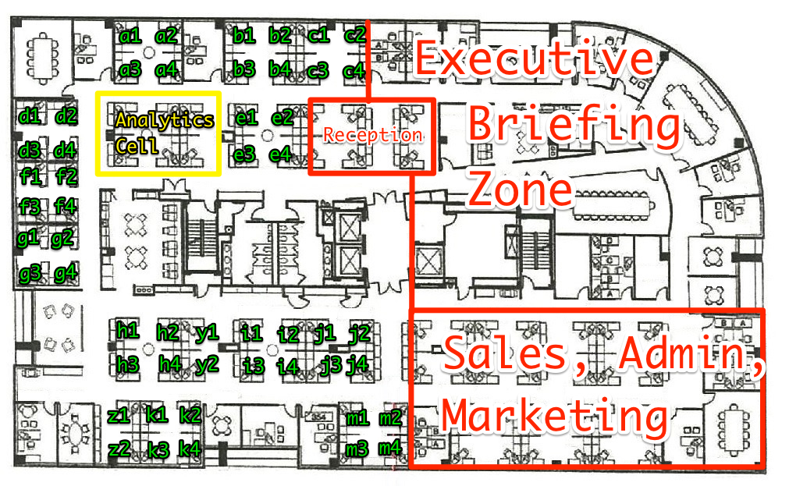

# BlackSky DC Seating Draft
Outlined below is the algorithm we will use for selecting seats in the new office space.

You can discuss changes or suggestions by opening a github issue, or by bringing up the topic in the #dc-office-draft slack channel.

If you want to formally propose a change, open a pull request! The team can vote on it in slack and we can merge based on the outcome of the vote.

## Non-negotiable Terms:

+ Only the seats labeled in green may be selected
+ Scott or Paul has a right to veto the result
+ **Quads:** A block of four desks will be considered "locked" once three of the
  four seats have been selected. This is to ensure that:
  - New hires can be seated close to the people with whom they'll be working most closely
  - Teammates coming in from out of town will have room to sit with their teammates
+ There is no "locking" rule for groups two desks

Additionally, everyone from whom we've received guidelines for this activity has mentioned that
people who assume a window seat should expect to deal with some glare:
the windows are half-height (not floor to ceiling like our current
office), and we are *strongly encouraged* to leave the blinds up at all times to
maximize natural light in the space.

## Draft Order

1. Users are ranked by their start date at the company.
2. Users will self report, on the honor code, how many days per week they work from home
3. The number of days per week spent working from home will be multiplied by two to determine an offset `(wfh_per_week * 2)`
4. The offset will be applied to their rank to determine their new position

> If you are 10th in line, and you work from home 2 days per week, you are now 14th in line

5. In the case of a tie for a modified rank, the person with a longer tenure breaks the tie

## Running the Draft
1. Picker is notified in a public slack channel that it is their turn to make a selection
2. Picker identifies desired seat by its label
3. Annotation is made on chart that seat is no longer available
4. If the selected seat fills the third seat in a quad, the reamining seat is removed from the chart (quad is now full).
5. New chart is posted to slack
6. GOTO i
